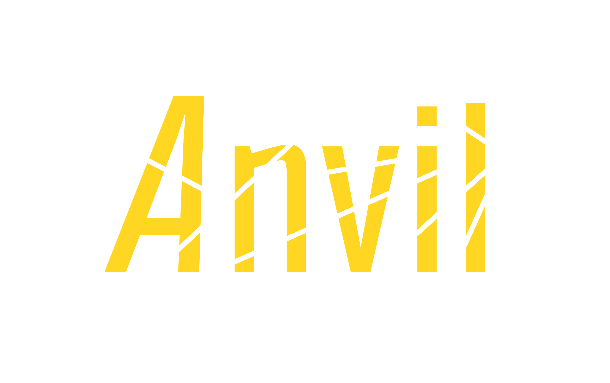

# Anvil



Styled console output for Python. Zero dependencies.

## Install

```bash
pip install anvil-atui
```

## Usage

```python
from anvil import console as ui
```

## Messages

```python
ui.info("loading config")
# → loading config

ui.success("done")
# ✓ done

ui.warning("file is outdated")
# ! file is outdated

ui.error("connection failed")
# ✗ connection failed

ui.step("intermediate step")
# · intermediate step

ui.debug("value x = 42")  # only when verbose=True
# · value x = 42
```

## Sections

```python
ui.title("Setup")

with ui.section("Check dependencies"):
    ui.step("python3")
    ui.step("git")

# output:
# ─────────────────────────
# Setup
# ─────────────────────────
# Check dependencies
#   · python3
#   · git
```

## Spinner

```python
with ui.spinner("connecting to server") as sp:
    connect()
    sp.set_final("connected")

# output during work:
# ⟳ connecting to server

# output after completion:
# ✓ connected
```

## Progress

```python
files = ["a.txt", "b.txt", "c.txt"]
with ui.progress("copying files", total=len(files)) as bar:
    for i, f in enumerate(files, 1):
        copy(f)
        bar.update(i)

# output:
# copying files  ████████░░░░░░░░░░░░░░░░  50% (2/3)
```

## Task

```python
with ui.task("Compile project"):
    build()

# output on success:
# ✓ Compile project (2.3s)

# output on failure:
# ✗ Compile project
# ✗ connection failed
```

## Numbered steps

```python
steps = ["Download", "Extract", "Check", "Install"]
for i, name in enumerate(steps, 1):
    with ui.numbered_step(i, len(steps), name):
        do_step(i)

# output:
# [1/4] Download
# [2/4] Extract
# [3/4] Check
# [4/4] Install
```

## Info block

```python
ui.info_block("my-package", {"mp3": 12, "txt": 3}, footer="total 15 files")

# output:
# ─────────────────────────
# my-package
# mp3 12 · txt 3
# total 15 files
# ─────────────────────────
```

## Table

```python
ui.table(["File", "Size", "Status"], [
    ["a.mp3", "3.2 MB", "ok"],
    ["b.txt", "1 KB", "ok"],
])

# output:
# File       Size   Status
# ─────────────────────────
# a.mp3      3.2 MB ok
# b.txt      1 KB   ok
```

## Box

```python
ui.box("Warning: action cannot be undone!", style="warn")

# output:
# ┌──────────────────────────┐
# │ Warning: action cannot be undone! │
# └──────────────────────────┘
```

## Input

```python
name = ui.ask("Enter name", default="guest")
# Enter name [guest]: →

ok = ui.confirm("Continue?", default=True)
# Continue? [Y/n]: →

choice = ui.select("Environment", ["dev", "staging", "prod"])
# Environment
#   1) dev
#   2) staging
#   3) prod
# Your choice [1-3, default 1]: →

secret = ui.password("Access token")
# Access token: →
```

## Timer

```python
with ui.timer("full run"):
    do_everything()

# output:
# · full run: 12.5s
```

## Run wrapper

```python
def main():
    ...

if __name__ == "__main__":
    ui.run(main)
```

Catches Ctrl+C and unhandled exceptions. Exits with code 130 on interrupt, 1 on error.

## Environment

| Variable | Effect |
|----------|--------|
| `NO_COLOR=1` | No color |
| `NO_MOTION=1` | No animation |
| No TTY | Animation disabled |
| No truecolor | 16-color fallback |
| No UTF-8 | ASCII fallback |

## Singleton

```python
from anvil import console, get_manager

ui = console
ui = get_manager()
```

## License

MIT - see [LICENSE](LICENSE).
